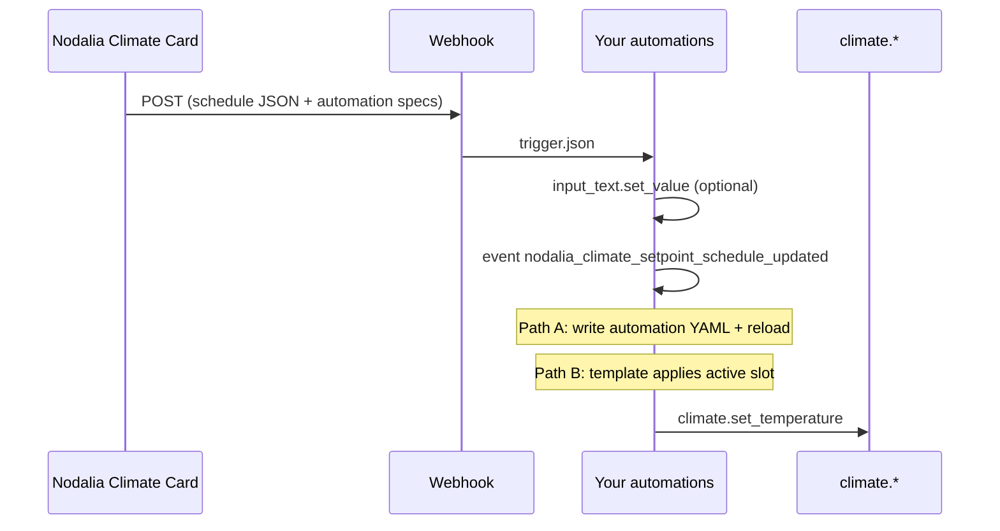

# Climate card — weekly setpoint schedule

The **Nodalia Climate Card** can manage a **weekly setpoint schedule** (consignas por franjas horarias) from the dashboard. Saving does **not** write to the Lovelace YAML — the card sends the schedule to Home Assistant through a **webhook**. Your automations store the JSON and apply `climate.set_temperature` at the right times.

**Requires Nodalia Cards `1.2.0`** (setpoint schedule and WebSocket webhook support).

---

## Quick start

### 1. Choose your IDs

Pick values once per thermostat. Use the **same** `YOUR_ROOM` slug everywhere for that room.

| Placeholder | Example | Used in |
|-------------|---------|---------|
| `YOUR_CLIMATE_ENTITY` | `climate.living_room` | Card `entity:` |
| `YOUR_ROOM` | `living_room` | Helper entity id suffix |
| `YOUR_DISPLAY_NAME` | `Living room` | Helper name, automation alias |
| `WEBHOOK_ID` | `nodalia_climate_setpoint_schedule` | Card + **one** webhook automation (shared) |

Resulting entities for one room:

| Role | Entity / id |
|------|-------------|
| Thermostat | `climate.YOUR_CLIMATE_ENTITY` |
| Schedule storage | `input_text.nodalia_climate_schedule_YOUR_ROOM` |
| Webhook | `WEBHOOK_ID` (not an entity — automation trigger id) |

### 2. Create the storage helper

Copy [`examples/climate-setpoint-schedule-helpers.yaml`](../examples/climate-setpoint-schedule-helpers.yaml), replace `YOUR_ROOM` and `YOUR_DISPLAY_NAME`, and add to Home Assistant (YAML or **Settings → Helpers**).

```yaml
input_text:
  nodalia_climate_schedule_living_room:          # ← YOUR_ROOM
    name: "Nodalia schedule — Living room"       # ← YOUR_DISPLAY_NAME
    max: 255
    initial: '{"v":3,"b":"","n":0}'
```

> **255 characters:** schedules are stored in a compact format (`v:1` / `v:2` / `v:3`). See [Compact storage format](#compact-storage-format). For very large schedules use [Path A](#path-a-per-slot-automations-on-disk).

### 3. Configure the climate card

In the visual editor (**Setpoint schedule** section) or YAML — see [`examples/climate-card.yaml`](../examples/climate-card.yaml):

```yaml
type: custom:nodalia-climate-card
entity: climate.living_room                      # ← YOUR_CLIMATE_ENTITY
show_schedule_button: true
setpoint_schedule_webhook: nodalia_climate_setpoint_schedule
setpoint_schedule_helper: input_text.nodalia_climate_schedule_living_room
setpoint_schedule_week_starts_on: monday         # or sunday
security:
  allow_webhooks_for_non_admin: true             # if non-admins save schedules
```

Tap **`mdi:calendar-clock`** on the card to open the weekly agenda, add time blocks, and **Save**.

### 4. Add the webhook automation (once per home)

Copy [`examples/climate-setpoint-schedule-webhook.yaml`](../examples/climate-setpoint-schedule-webhook.yaml). Change `webhook_id` only if you picked a custom `WEBHOOK_ID`.

This automation:

1. Writes `storage_state` to the helper from the card payload.
2. Fires `nodalia_climate_setpoint_schedule_updated` so apply automations can react.

Reload automations. After **Save** on the card, check **Traces** — you should see the payload and the helper updated.

### 5. Apply temperatures (pick one path)

| Path | Best for | File |
|------|----------|------|
| **B** (recommended) | No shell access; one automation per thermostat | [`climate-setpoint-schedule-path-b.yaml`](../examples/climate-setpoint-schedule-path-b.yaml) |
| **A** | Many blocks (v:3 storage); native time triggers | [`climate-setpoint-schedule-shell.yaml`](../examples/climate-setpoint-schedule-shell.yaml) + webhook optional steps |

**Path B:** copy the example **once per thermostat**, replace `YOUR_CLIMATE_ENTITY`, `YOUR_ROOM`, and `YOUR_DISPLAY_NAME`, reload automations, then **Run actions** once to verify `climate.set_temperature` runs.

---

## Multiple thermostats

| Component | How many? |
|-----------|-----------|
| Webhook automation | **1** (shared `WEBHOOK_ID`) |
| `input_text` helper | **1 per card** |
| Path B apply automation | **1 per card** |
| Path A shell output | **1 YAML file per card** (auto-generated on save) |

Each card sends its own `entity_id` and `storage_entity_id` in the webhook JSON — the shared webhook automation handles all of them.

---

## Example files

| File | Purpose |
|------|---------|
| [`climate-card.yaml`](../examples/climate-card.yaml) | Card config (`YOUR_*` placeholders) |
| [`climate-setpoint-schedule-helpers.yaml`](../examples/climate-setpoint-schedule-helpers.yaml) | `input_text` storage helper |
| [`climate-setpoint-schedule-webhook.yaml`](../examples/climate-setpoint-schedule-webhook.yaml) | Webhook automation (once) |
| [`climate-setpoint-schedule-path-b.yaml`](../examples/climate-setpoint-schedule-path-b.yaml) | Apply active slot (per thermostat) |
| [`climate-setpoint-schedule-shell.yaml`](../examples/climate-setpoint-schedule-shell.yaml) | Path A `shell_command` (optional) |

---

## How it works



1. User edits the weekly agenda in the card (fullscreen composer) and taps **Save**.
2. The card triggers your webhook via WebSocket **`webhook/handle`** when possible, then falls back to `POST /api/webhook/<WEBHOOK_ID>`.
3. The **webhook automation** stores the schedule and fires an event.
4. **Path A** or **Path B** calls `climate.set_temperature` for the active time block.

---

## Card options

| Option | Description |
|--------|-------------|
| `show_schedule_button` | Shows the agenda button (`mdi:calendar-clock`). Default `true`. |
| `setpoint_schedule_webhook` | Webhook ID (no URL). Must match the webhook automation `webhook_id`. |
| `setpoint_schedule_helper` | **Required** `input_text` entity. Create it before saving. Must match the helper you created in step 2. If empty, the card guesses `input_text.nodalia_climate_schedule_<slug>`. |
| `setpoint_schedule_week_starts_on` | `monday` (default) or `sunday` — first row in the agenda. |
| `security.allow_webhooks_for_non_admin` | When `true`, non-admin users can save schedules from the card. |

The schedule button appears when `show_schedule_button` is enabled and a webhook ID is set.

---

## Webhook payload

On save, the card sends JSON like:

```json
{
  "type": "climate_setpoint_schedule",
  "entity_id": "climate.living_room",
  "storage_entity_id": "input_text.nodalia_climate_schedule_living_room",
  "storage_state": "{\"v\":2,\"s\":[93726209]}",
  "automation_specs": [],
  "automation_yaml_bundle": "- id: '...'\n  alias: ...",
  "automation_id_prefix": "nodalia_climate_climate_living_room_"
}
```

### Schedule object (verbose form in payload)

| Field | Type | Description |
|-------|------|-------------|
| `enabled` | boolean | Master switch. |
| `slots` | array | Time blocks (see below). |

**Slot fields:**

| Field | Values | Description |
|-------|--------|-------------|
| `day` | `mon` … `sun` | Weekday for this block. |
| `start` | `HH:MM` | Block start (local time). |
| `end` | `HH:MM` | Block end. |
| `temperature` | number | Target setpoint (°C). |
| `enabled` | boolean | When `false`, slot is ignored. |

### Generated automation behavior (Path A)

For each enabled slot, the card can build one automation that triggers at `start` on that weekday and runs `climate.set_temperature`. There is **no** trigger at `end` — the next slot’s start or [Path B](#path-b-single-automation-active-slot) applies the next setpoint.

---

## Compact storage format

`storage_state` in `input_text` is **not** always the verbose `schedule.slots` object:

| Version | Shape | ~Capacity | Path B |
|---------|--------|-----------|--------|
| **3** (default for many blocks) | `{"v":3,"b":"<base64>","n":12}` | ~40 blocks | No (use Path A) |
| **2** | `{"v":2,"s":[93726209,…]}` | ~22–27 blocks | Yes |
| **1** | `{"v":1,"s":[[0,140,965,21]]}` | ~14–18 blocks | Yes |
| Verbose JSON | `{"enabled":true,"slots":[…]}` | ~2–3 blocks | Yes |

**Unpack v:2 in templates** — Home Assistant Jinja has no `&` / `>>`; use `%` and `//`:

| Field | Template |
|-------|----------|
| start (minutes) | `(pi % 512) * 5` |
| end (minutes) | `((pi // 512) % 512) * 5` |
| day index 0–6 | `(pi // 262144) % 8` → `['mon','tue',…][index]` |
| disabled | `(pi // 2097152) % 2` |
| temperature | `((pi // 4194304) % 256) + 5` |

Full working template: [`examples/climate-setpoint-schedule-path-b.yaml`](../examples/climate-setpoint-schedule-path-b.yaml).

---

## Path A: Per-slot automations on disk

Best for **v:3** storage or native time triggers. Requires write access to `/config`.

1. Add [`examples/climate-setpoint-schedule-shell.yaml`](../examples/climate-setpoint-schedule-shell.yaml) to `configuration.yaml`.
2. Uncomment in the webhook automation:

```yaml
  - action: shell_command.nodalia_climate_write_setpoint_schedule_automations
    data:
      value: "{{ trigger.json | tojson }}"
  - action: automation.reload
```

Output: `/config/automations/nodalia_climate_<entity>_schedule.yaml`. Ensure `automation: !include_dir_merge_list automations/`.

---

## Path B: Single automation (active slot)

Best when you **cannot** use `shell_command`. Copy [`examples/climate-setpoint-schedule-path-b.yaml`](../examples/climate-setpoint-schedule-path-b.yaml) and replace:

```yaml
# alias: "Nodalia Climate | Apply active setpoint (YOUR_DISPLAY_NAME)"
# ...
#   entity_id: climate.YOUR_CLIMATE_ENTITY        ← 3 places (triggers + variables)
#   storage: input_text.nodalia_climate_schedule_YOUR_ROOM
```

Rules (same as the card UI): on a weekday, among slots where **now** is between `start` and `end`, the slot with the **latest** `start` wins.

Runs every minute and when `nodalia_climate_setpoint_schedule_updated` fires for that `entity_id`.

**Verify:** open the automation → **Run actions**. With an active slot, `active` should be e.g. `{'temperature': 21}` and `climate.set_temperature` should run.

> **Do not** use `schedule.slots` alone — after save the helper often stores `{"v":2,"s":[…]}` without a `slots` key.

---

## Event: `nodalia_climate_setpoint_schedule_updated`

| `event_data` | Description |
|--------------|-------------|
| `entity_id` | Climate entity from the card |
| `storage_entity_id` | Helper used for JSON |
| `slot_count` | Number of slot automations in payload |
| `automation_id_prefix` | Prefix for generated automation ids |

Example trigger (Path B):

```yaml
  - trigger: event
    event_type: nodalia_climate_setpoint_schedule_updated
    event_data:
      entity_id: climate.YOUR_CLIMATE_ENTITY
```

Use `event:` + `event_data:` — **not** `action: event.fire` (Spook flags that as unknown).

---

## Security

- **`local_only: false`** on the webhook trigger if you use HA remotely (Nabu Casa, mobile app). With `local_only: true`, saves may return **200** without running the automation.
- **`1.2.0+`** uses WebSocket **`webhook/handle`** from the dashboard first — still keep `local_only: false` for reliability.
- Treat `WEBHOOK_ID` like a password.
- Set `security.allow_webhooks_for_non_admin: true` if household members without admin rights should save schedules.

---

## Troubleshooting

| Symptom | Check |
|---------|--------|
| No schedule button | `show_schedule_button: true` and `setpoint_schedule_webhook` set. |
| Save does nothing | `WEBHOOK_ID` matches on card and automation; automation enabled; **Logs**. |
| Traces empty / helper unchanged | Webhook `local_only: true` while remote → set **`local_only: false`**. Update to **`1.2.0+`**. |
| 401 / webhook denied | Admin user, or `allow_webhooks_for_non_admin: true`. |
| Schedule lost after reload | Helper missing or `setpoint_schedule_helper` mismatch. |
| Path B `TemplateSyntaxError: '&'` | Use `%` and `//`, not `&` / `>>` — see [Path B example](../examples/climate-setpoint-schedule-path-b.yaml). |
| Path B `active: null` | Template uses `schedule.slots` but helper has compact `v:2` — use the Path B example file. |
| Path B wrong entity | Replace all `YOUR_CLIMATE_ENTITY` / `YOUR_ROOM` placeholders. |
| Temperature never changes | Webhook OK but Path A/B missing or disabled. |
| Wrong day / time | HA server timezone; days are `mon`–`sun`. |

**Manual webhook test** (replace host and id):

```bash
curl -X POST \
  -H "Content-Type: application/json" \
  -d '{"entity_id":"climate.living_room","storage_entity_id":"input_text.nodalia_climate_schedule_living_room","storage_state":"{\"v\":2,\"s\":[]}"}' \
  http://homeassistant.local:8123/api/webhook/nodalia_climate_setpoint_schedule
```

---

## Custom scripts

From the webhook automation:

```yaml
  - action: script.your_install_climate_schedule
    data:
      entity_id: "{{ entity_id }}"
      automation_specs: "{{ specs }}"
      automation_yaml_bundle: "{{ trigger.json.automation_yaml_bundle | default('') }}"
```

---

## Related changelog

Setpoint schedule, agenda UI, WebSocket webhooks, and agenda scroll fixes are included in stable **`1.2.0`**. Per-alpha history: [`CHANGELOG-PRERELEASES.md`](../CHANGELOG-PRERELEASES.md).
