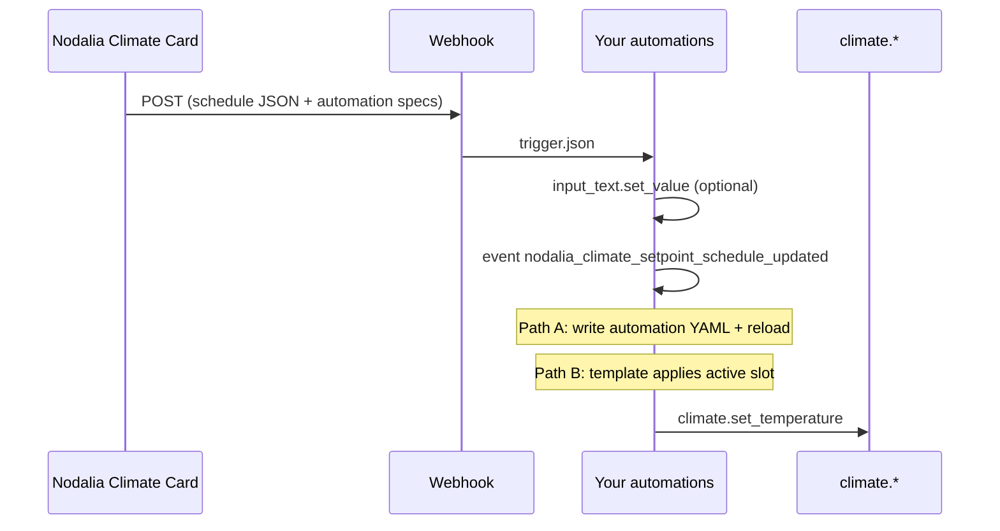

# Climate card — weekly setpoint schedule

The **Nodalia Climate Card** can manage a **weekly setpoint schedule** (consignas por franjas horarias) from the dashboard. Saving the schedule does **not** write to the Lovelace card YAML; instead the card POSTs to a Home Assistant **webhook** you configure. Your automations (or scripts) persist the JSON and apply temperatures at the right times.

This guide is the canonical reference. Copy-paste YAML lives under [`examples/`](../examples/):

| File | Purpose |
|------|---------|
| [`climate-card.yaml`](../examples/climate-card.yaml) | Card config with webhook + helper |
| [`climate-setpoint-schedule-helpers.yaml`](../examples/climate-setpoint-schedule-helpers.yaml) | `input_text` storage helper |
| [`climate-setpoint-schedule-webhook.yaml`](../examples/climate-setpoint-schedule-webhook.yaml) | Main webhook automation |
| [`climate-setpoint-schedule-shell.yaml`](../examples/climate-setpoint-schedule-shell.yaml) | Optional `shell_command` to write per-slot automations |

---

## How it works



1. User edits the weekly agenda in the card (fullscreen composer) and taps **Save**.
2. The card calls `POST /api/webhook/<setpoint_schedule_webhook>` with a JSON body (see [Webhook payload](#webhook-payload)).
3. Your **webhook automation** stores the schedule (optional) and fires an event.
4. You either install **one automation per slot** (generated YAML) or run a **single automation** that reads the stored JSON and applies the active slot.

---

## Card configuration

In the visual editor (**Setpoint schedule** section) or in YAML:

```yaml
type: custom:nodalia-climate-card
entity: climate.living_room
show_schedule_button: true
setpoint_schedule_webhook: nodalia_climate_setpoint_schedule
setpoint_schedule_helper: input_text.climate_schedule_dormitorios
setpoint_schedule_week_starts_on: monday   # or sunday — first row in the agenda
security:
  allow_webhooks_for_non_admin: true       # required if non-admin users save schedules
```

| Option | Description |
|--------|-------------|
| `show_schedule_button` | Shows the agenda button (`mdi:calendar-clock`). Default `true`. |
| `setpoint_schedule_webhook` | Webhook ID (no URL path). Example: `nodalia_climate_setpoint_schedule`. |
| `setpoint_schedule_helper` | **Required** `input_text` entity. Create it in YAML before saving schedules. The card sends this id in the webhook; Path B and reload after refresh depend on it. If empty, the card guesses `input_text.nodalia_climate_schedule_<slug>` — create that entity or set this field explicitly (e.g. `input_text.climate_schedule_dormitorios`). |
| `setpoint_schedule_week_starts_on` | `monday` (default) or `sunday` — order of day rows in the UI. |
| `security.allow_webhooks_for_non_admin` | When `true`, non-admin users can trigger the webhook from the card (same pattern as the calendar card). |

The schedule button appears when `show_schedule_button` is enabled and a webhook ID is set.

---

## Home Assistant setup (minimum)

### 1. Storage helper (required)

Create an `input_text` helper **before** using the schedule composer (**Settings → Devices & services → Helpers**, or YAML). Use any entity id you like; it must match `setpoint_schedule_helper` on the card:

```yaml
input_text:
  climate_schedule_dormitorios:
    name: Nodalia consignas — Dormitorios
    max: 255
    initial: '{"v":3,"b":"","n":0}'
```

Card config:

```yaml
setpoint_schedule_helper: input_text.climate_schedule_dormitorios
```

Without this entity, the webhook cannot persist the JSON and the schedule is lost on reload. [Path B](#path-b-single-automation-active-slot) also reads from this helper.

> **255 character limit:** Home Assistant `input_text` values are capped at **255 characters**. The card saves a **compact format** (`v: 1`) so more slots fit; legacy verbose JSON is still read if already stored. See [Compact storage format](#compact-storage-format). If you outgrow 255 chars, use [Path A](#path-a-per-slot-automations-on-disk).

### 2. Webhook automation

Create an automation (YAML mode) from [`examples/climate-setpoint-schedule-webhook.yaml`](../examples/climate-setpoint-schedule-webhook.yaml):

- **Trigger:** `webhook` with `webhook_id: nodalia_climate_setpoint_schedule`, `local_only: true`, `POST` only.
- **Actions:**
  - Save `trigger.json.storage_state` to `trigger.json.storage_entity_id` when present.
  - Fire event `nodalia_climate_setpoint_schedule_updated` for other automations/scripts.

Reload automations after adding it.

Correct event action shape ([Fire an event](https://www.home-assistant.io/docs/scripts/#fire-an-event) — use `event:`, **not** `action: event.fire`, which Spook flags as unknown):

```yaml
  - event: nodalia_climate_setpoint_schedule_updated
    event_data:
      entity_id: "{{ entity_id }}"
      storage_entity_id: "{{ storage_entity }}"
      slot_count: "{{ specs | length }}"
      automation_id_prefix: "{{ prefix }}"
```

Do **not** use `action: event.fire` — that service does not exist in Home Assistant.

### 3. Apply temperatures

The webhook automation **only** stores data and notifies. You still need something that calls `climate.set_temperature`. Choose **Path A** or **Path B** below.

---

## Webhook payload

On save, the card sends JSON like:

```json
{
  "type": "climate_setpoint_schedule",
  "card": "nodalia-climate-card",
  "card_version": "1.2.0-alpha.28",
  "entity_id": "climate.living_room",
  "friendly_name": "Living Room",
  "schedule": {
    "enabled": true,
    "slots": [
      {
        "id": "slot_abc123",
        "day": "mon",
        "start": "08:00",
        "end": "22:00",
        "temperature": 21,
        "enabled": true
      }
    ]
  },
  "storage_entity_id": "input_text.nodalia_climate_schedule_living_room",
  "storage_state": "{\"enabled\":true,\"slots\":[...]}",
  "automation_specs": [ /* see below */ ],
  "automation_yaml_bundle": "- id: '...'\n  alias: ...",
  "automation_id_prefix": "nodalia_climate_climate_living_room_",
  "ha_action": {
    "action": "input_text.set_value",
    "target": { "entity_id": "input_text.nodalia_climate_schedule_living_room" },
    "data": { "value": "..." }
  }
}
```

### Schedule object

| Field | Type | Description |
|-------|------|-------------|
| `enabled` | boolean | Master switch; when `false`, generated automations are empty. |
| `slots` | array | Time blocks (see slot fields). |

**Slot fields:**

| Field | Values | Description |
|-------|--------|-------------|
| `id` | string | Stable id (used in automation `id`). |
| `day` | `mon` … `sun` | Weekday for this block. |
| `start` | `HH:MM` | Block start (local time). |
| `end` | `HH:MM` | Block end (visual + active-slot logic). |
| `temperature` | number | Target setpoint (°C) for `climate.set_temperature`. |
| `enabled` | boolean | When `false`, slot is ignored. |

### Generated automation behavior

For each enabled slot, the card builds one Home Assistant automation that:

- **Triggers** at `start` (converted to `HH:MM:SS`) on that slot’s weekday.
- **Runs** `climate.set_temperature` on `entity_id` with `temperature: <slot.temperature>`.

There is **no** automatic trigger at `end`. When a block ends, the setpoint does not change until the next slot’s **start** (or until [Path B](#path-b-single-automation-active-slot) applies another active block). Plan overlapping slots or consecutive starts accordingly.

`automation_specs` is a JSON array of automation objects (id, alias, trigger, condition, action). `automation_yaml_bundle` is the same list as YAML text ready to write to a file.

### Compact storage format

`storage_state` in `input_text` is **not** the verbose webhook `schedule` object. The card picks the smallest encoding that fits in **255 characters**:

| Version | Shape | ~Capacity |
|---------|--------|-----------|
| **3** (default for many blocks) | `{"v":3,"b":"<base64>","n":12}` | **~40–45 blocks** |
| **2** | `{"v":2,"s":[67207708,…]}` | ~22–27 blocks (Path B friendly) |
| **1** (legacy compact) | `{"v":1,"s":[[0,140,965,21]]}` | ~14–18 blocks |
| Verbose JSON | `{"enabled":true,"slots":[…]}` | ~2–3 blocks (still read on load) |

**Version 3 (binary base64)** — 4 bytes per block (times quantized to 5 minutes, same as the agenda):

```json
{"v":3,"b":"BAGCHA==","n":1}
```

| Field | Meaning |
|-------|---------|
| `v` | `3` |
| `b` | Base64 blob: each block = 4-byte packed uint32 |
| `n` | Block count (for decode) |
| `e` | Optional; `0` = schedule disabled |

Packed bits per block: `start/5` (9 bits) · `end/5` (9 bits) · `day` 0–6 (3 bits) · `disabled` (1 bit) · `temp−5` (8 bits).

Example — Monday 02:20–16:05 @ 21 °C:

| Verbose (~118 chars) | v1 (~28 chars) | **v3 (~28 chars)** |
|----------------------|----------------|---------------------|
| full JSON with `id`, `day`, … | `{"v":1,"s":[[0,140,965,21]]}` | `{"v":3,"b":"BAGCHA==","n":1}` |

**Version 2** — array of packed integers (easier for [Path B](#path-b-single-automation-active-slot) templates):

```json
{"v":2,"s":[67207708]}
```

Unpack in templates: `startQ = p & 511` is wrong — use `(p & 511)` for start/5, `((p >> 9) & 511) * 5` for minutes, etc. (see Path B example below).

Re-save from the card to migrate older `v:1` or verbose JSON to `v:3`.

---

## Path A: Per-slot automations on disk

Best when you want native time triggers and can write under `/config` (Home Assistant OS / Supervised).

1. Add [`examples/climate-setpoint-schedule-shell.yaml`](../examples/climate-setpoint-schedule-shell.yaml) to `configuration.yaml` as `shell_command`.
2. In the webhook automation, after saving `input_text`, add:

```yaml
  - action: shell_command.nodalia_climate_write_setpoint_schedule_automations
  - action: automation.reload
```

The shell command writes `/config/automations/nodalia_climate_<entity>_schedule.yaml` from `automation_yaml_bundle` and reloads automations.

Ensure `automation: !include_dir_merge_list automations/` (or equivalent) loads that folder.

---

## Path B: Single automation (active slot)

Best when you cannot use `shell_command` or prefer one automation reading the stored JSON.

The card’s UI uses “active slot” rules: on a given weekday, among slots where **now** is between `start` and `end`, the slot with the **latest** `start` wins.

> **Storage v:3 (binary):** fits **~40 blocks** in `input_text`, but Home Assistant templates cannot decode base64 easily. For large schedules, use **[Path A](#path-a-per-slot-automations-on-disk)** (recommended) or apply on save via the webhook `schedule` / `automation_specs` payload. Path B below supports **v:1**, **v:2**, and legacy verbose JSON (re-save once to get v:2/v:3 for persistence; use Path A to apply if you have v:3).

Example automation (adjust `entity_id` and `storage`):

```yaml
alias: "Nodalia Climate | Apply active setpoint (living room)"
mode: single

triggers:
  - trigger: time_pattern
    minutes: "/1"
  - trigger: event
    event_type: nodalia_climate_setpoint_schedule_updated
    event_data:
      entity_id: climate.living_room

variables:
  entity_id: climate.living_room
  storage: input_text.nodalia_climate_schedule_living_room
  parsed: "{{ states(storage) | from_json(default={}) }}"
  today_key: "{{ ['mon','tue','wed','thu','fri','sat','sun'][now().weekday()] }}"
  minutes_now: "{{ now().hour * 60 + now().minute }}"

actions:
  - if:
      - condition: template
        value_template: >-
          
            {{ parsed.e | default(1) != 0 }}
          
            {{ parsed.enabled | default(true) }}
          
    then:
      - variables:
          active: >-
            
            
            
              
                
                
                
                
                
                  
                    
                  
                    
                  
                  
                    
                    
                  
                
              
            
              
                
                  
                  
                  
                  
                    
                      
                    
                      
                    
                    
                      
                      
                    
                  
                
              
            
              
                
                  
                  
                  
                  
                  
                    
                  
                    
                  
                  
                    
                    
                  
                
              
            
            {{ ns.slot }}
      - if:
          - condition: template
            value_template: "{{ active is mapping }}"
        then:
          - action: climate.set_temperature
            target:
              entity_id: "{{ entity_id }}"
            data:
              temperature: "{{ active.temperature }}"
```

Runs every minute and immediately when the schedule is saved. Supports **v:1**, **v:2**, and legacy verbose JSON. For **v:3** binary storage, use [Path A](#path-a-per-slot-automations-on-disk).

---

## Event: `nodalia_climate_setpoint_schedule_updated`

Fired by the webhook automation so you can chain scripts:

| `event_data` | Description |
|--------------|-------------|
| `entity_id` | Climate entity from the card |
| `storage_entity_id` | Helper used for JSON (may be empty) |
| `slot_count` | Number of generated slot automations |
| `automation_id_prefix` | Prefix for automation ids (`nodalia_climate_<entity>_…`) |

Example trigger:

```yaml
trigger:
  - trigger: event
    event_type: nodalia_climate_setpoint_schedule_updated
    event_data:
      entity_id: climate.living_room
```

---

## Security

- Webhook automations should use `local_only: true` so only your LAN/HA instance can POST.
- The card uses `NodaliaUtils.postHomeAssistantWebhook` (same-origin, authenticated session when available).
- Set `security.allow_webhooks_for_non_admin: true` on the card if household members without admin rights should save schedules.

---

## Troubleshooting

| Symptom | Check |
|---------|--------|
| Save does nothing | Webhook ID on card matches automation `webhook_id`; automation enabled; check **Settings → System → Logs**. |
| 401 / webhook denied | User needs admin, or enable `allow_webhooks_for_non_admin`. |
| Schedule lost after reload | Helper not set, `input_text` failed (255 chars), or wrong `storage_entity_id`. |
| Spook: unknown action `event.fire` | Use `event: my_event_type` + `event_data:` (script “Fire event” action), not `action: event.fire`. |
| `extra keys not allowed` on `event_data` | Same fix: use `event:` / `event_data:` at the action root, not `action: event.fire` with a `data:` block. |
| Temperature never changes | Webhook works but Path A/B not configured; verify `climate.set_temperature` for your integration. |
| Wrong day / time | HA server timezone; slot `day` uses `mon`–`sun` (HA weekday in Path B template uses Monday = 0). |

**Verify webhook manually** (replace host and id):

```bash
curl -X POST \
  -H "Content-Type: application/json" \
  -d '{"entity_id":"climate.living_room","storage_state":"{\"enabled\":true,\"slots\":[]}"}' \
  http://homeassistant.local:8123/api/webhook/nodalia_climate_setpoint_schedule
```

(Use your HA URL; local webhooks may still require authentication depending on version — testing from the card is easiest.)

---

## Custom scripts

Instead of Path A/B, call your own script from the webhook automation:

```yaml
  - action: script.your_install_climate_schedule
    data:
      entity_id: "{{ entity_id }}"
      automation_specs: "{{ specs }}"
      automation_yaml_bundle: "{{ trigger.json.automation_yaml_bundle | default('') }}"
```

Use `automation_specs` for programmatic creation or `automation_yaml_bundle` for file-based installs.

---

## Related changelog

Setpoint schedule feature introduced in **`1.2.0-alpha.23`**; agenda UI and fixes through **`1.2.0-alpha.26`**. See [`CHANGELOG-PRERELEASES.md`](../CHANGELOG-PRERELEASES.md).
